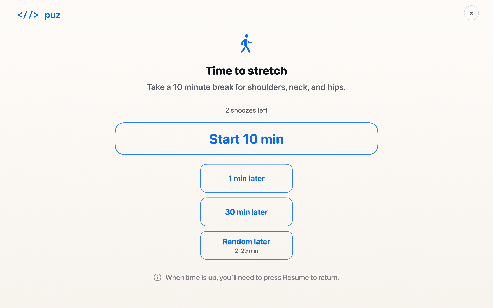
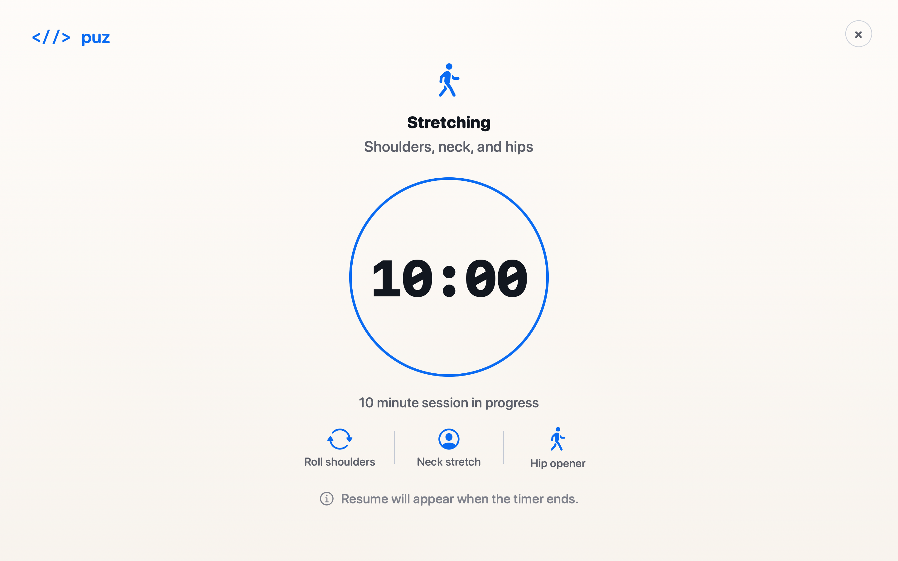

<p align="right"><a href="./README.ko.md">한국어</a> | English</p>

# puz

<p align="center">
  
  
  
  <a href="./LICENSE"></a>
</p>

> Movement breaks that interrupt you back.

puz is a small macOS menu bar app for movement and break routines that are intentionally hard to ignore. It can show a fullscreen start prompt, cover every connected display during the countdown, and return control only after you press **Resume**.

> **v0.2.1** is the current public release. `v0.2.0` remains the multi-routine source checkpoint.

## What is puz?

puz is a local-first routine interrupter for macOS. It lives in the menu bar, waits for the next scheduled moment, then opens a focused fullscreen flow so the break is visible, simple, and harder to dismiss by reflex.

The current app is intentionally small: a default routine set, one compact settings window, one fullscreen prompt flow, and local persistence for settings and completion/skip records.

## Why puz?

Regular reminders are easy to swipe away. puz is built for the moment when you want a short routine to become a real interruption: not a task manager, not a habit dashboard, just a clear pause that helps you move before returning to work.

## Features

- **Menu bar app** — compact `<//>` identity with status and settings access.
- **Multi-routine scheduling** — enabled routines project daily virtual slots from weekdays, time windows, run counts, gaps, and distribution.
- **Fullscreen focus flow** — prompt and countdown can cover every connected display.
- **Resume-required completion** — the countdown finishing is not the end; you explicitly press **Resume** to return.
- **Snooze and skip choices** — short, long, and random snooze choices, plus explicit close-session actions that keep completion records honest.
- **Local records** — settings, completion records, and skip records stay on your Mac.
- **System-language copy** — English and Korean app copy selected from the system-preferred language, with English fallback.
- **Theme-ready visuals** — the default visual language is blue/off-white, with a Black & White theme planned.

## Quick Install

### Download the macOS zip

Download [`puz-macos.zip`](https://github.com/hosioobo/puz/releases/latest/download/puz-macos.zip) from the latest GitHub Release, unzip it, then open `puz.app`.

The current app is unsigned and not notarized, so macOS may require manual first-open approval. If Finder blocks the app, Control-click `puz.app`, choose **Open**, then confirm.

### Build from source

Requirements:

- macOS 13+
- Swift 5.9+ / Xcode Command Line Tools

```bash
git clone https://github.com/hosioobo/puz.git
cd puz
swift run PauseCoreTestRunner
swift build --product PauseApp
Scripts/build_app.sh
```

### Open a source build

```bash
open dist/puz.app
```

## Getting Started

### 1. Launch puz

Open the unzipped `puz.app`, or `dist/puz.app` if you built from source. puz runs as a menu bar app rather than a Dock app.

### 2. Configure your routine

Use the settings window to adjust routine names, durations, active weekdays, time windows, daily run counts, minimum gaps, distribution mode, and snooze limits.

### 3. Wait for a prompt

At the next scheduled moment, puz shows the fullscreen start prompt.

### 4. Start, snooze, or close

From the start prompt you can start the session, snooze for a fixed delay, snooze for a random delay, or close the fullscreen flow. Closing with `×` does not record completion; the runtime scheduler simply recomputes the next trigger from the routine's normal schedule rule.

### 5. Resume when complete

After the countdown reaches zero, press **Resume** to dismiss the fullscreen overlay and return to work.

## Fullscreen Flow

### Start Prompt

The start prompt uses the default blue/off-white theme, a centered action symbol, the routine duration, and visible snooze choices. Snooze allowance appears before the session starts so the decision is clear.

### Countdown

The countdown screen keeps the routine visible with a circular progress ring, action symbol, step hints, and time remaining. The progress ring shrinks clockwise as the remaining time decreases.

### Completion / Resume

When time is up, the overlay switches to a completion state with a **Resume** call to action. The overlay stays up until Resume is pressed.

### Snooze behavior

The current flow supports:

- short fixed snooze
- long fixed snooze
- random snooze
- configurable maximum snooze count

Snoozing is a pre-start decision; it is not shown inside the active countdown.

## Scheduling Model

### Active days and time windows

The current schedule model supports multiple enabled routines. Each routine can define active weekdays, one or more same-day time windows, runs per day, a minimum gap, and either evenly-spread or stable-random distribution.

### Virtual slots

At runtime, puz derives concrete virtual slots from routine rules, then picks the earliest available slot across enabled routines. Slot metadata is stored with completion and skip records so one completed slot does not hide later valid slots for the same routine.

### Compatibility

Legacy fixed-time routines still work: a fixed time maps to one virtual slot at the scheduled time.

### Future schedule work

Cross-midnight windows, exceptions, quiet times, and richer snooze policy are planned product decisions rather than implicit behavior today.

## Settings

The current settings window covers:

- routine list management
- enabled state and routine name
- action type and duration
- active weekdays and time windows
- runs per day, minimum gap, and distribution mode
- snooze limit

Language currently follows the system-preferred language. A manual app-language selector can be added later if needed.

## Themes

### Default Theme

The default puz theme is the current blue/off-white fullscreen visual system.

### Planned Themes

- **Black & White** — planned as a separate theme option later.

## Screenshots

These screenshots are generated from the current SwiftUI fullscreen views and contain no desktop content.

| Start prompt | Countdown |
| --- | --- |
|  |  |

## Development

### Requirements

- macOS 13+
- Swift 5.9+ / Xcode Command Line Tools

### Run tests

This project uses a SwiftPM executable test runner so it can run in Command Line Tools environments where XCTest may not be available.

```bash
swift run PauseCoreTestRunner
```

The runner covers scheduling, snooze choices and limits, numeric input sanitizing, persistence, completion-record behavior, and English/Korean localization copy.

### Build

```bash
swift build --product PauseApp
```

### Build app bundle

```bash
Scripts/build_app.sh
```

The script creates `dist/puz.app` from the SwiftPM release binary.

## Project Structure

```text
Package.swift
  SwiftPM package definition
Sources/PauseCore
  Models, schedule engine, snooze choices, persistence, localization
Sources/PauseApp
  Menu bar app, fullscreen prompt, settings window, countdown overlay
Sources/PauseCoreTestRunner
  Command-line test runner
Resources/Info.plist
  macOS app bundle metadata
Scripts/build_app.sh
  Builds dist/puz.app from the SwiftPM release binary
docs/index.html
  Text-only public homepage
```

The SwiftPM target names still use the original `Pause*` prefix internally. The app name, bundle name, and executable are `puz`.

## Roadmap

- Signed and notarized release build.
- Short demo media.
- Exceptions / quiet times.
- Manual language selection.
- Black & White theme.

## Contributing

puz is still early. If you want to contribute, keep changes small, local-first, and easy to verify from SwiftPM.

Useful checks before opening a PR:

```bash
swift run PauseCoreTestRunner
swift build --product PauseApp
Scripts/build_app.sh
```

## License

MIT. See [`LICENSE`](./LICENSE).
